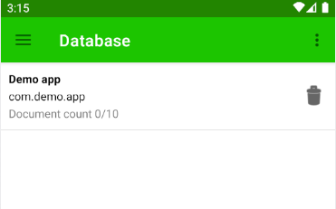

# Clorabase Database
Clorabase Database is a flexible, scalable database for android apps. It keeps your data in sync across client apps through realtime listeners and offers offline support for android apps so you can build responsive apps that work regardless of network latency or Internet connectivity. It is NoSql document-oriented database.

## Key features
- No account needed
- Simple & easy SDK
- NoSql document-oriented

### Initializing the class.
To use any method of the class, first you have to initialize it. Use `getInstance(Context)` method to initialize & get the refference of the class.

```java
ClorabaseDatabase db = ClorabaseDatabase.getInstance(this);
```

### Writing to database
To add data to document, use `document(String,Map)` method as shown below:
```java
Map<String,Object> map = new HashMap<>();
map.put("name","Steev");
map.put("age",27);
map.put("isDeveloper",true);

db.getInstance(this).document("demoDocument",map,false)
        .addOnSuccessListener(value1 -> {
            // success --> Writing task have void values.
        }).addOnFailureListener(exception -> {
            // Failed
        });
```
Pass 3rd argument as 'true' if you want to update the document. If true, It will create document if not already exist.
?> Note :- You can only create maximum of 10 documents.

### Reading from database
To fetch data of a document, use `getDocumentData(String)` method as shown below:

```java
ClorabaseDatabase.getInstance(this).getDocumentData("demoDocument")
        .addOnSuccessListener(value1 -> {
        // value1 is a Map of type <String,Object>
            String name = (String) value1.get("name");
            int age = (int) value1.get("age");
            boolean isDev = (boolean) value1.get("isDev");
        }).addOnFailureListener(excaption -> {
            // Failed with an exception
        );
```

### Managing database
You can also manage your database from the console. Just goto 'Database' & add your app.


After that, you can see the number of document in that database. You can only delete the database from here.




### [Example](https://github.com)
*That's all what you need to know about the database.*


