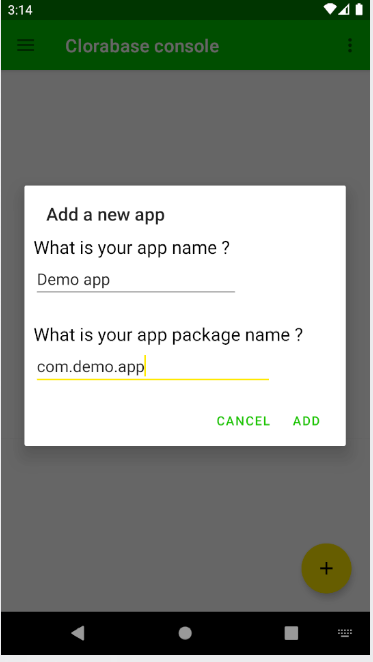

# Clorabase Database
Clorabase Database is an open-source, flexible, serverless database for android apps. It offers offline support for Android apps so you can build responsive apps that work regardless of network latency or Internet connectivity. It is NoSql key-value typed database based on [CloremDB](https://github.com/ErrorxCode/CloremDB). Befour using this database, have a look at **CloremDB**

## Key features
- No account is needed
- Simple & easy SDK
- NoSql key-value relationships

### Initializing the class.
*First of all, add your app to clorabase from the console. Go to the "Database" section and click the '+' icon to add a new app*.
After that, just initialize the database and class as below :-

```java
ClorabaseDatabase db = ClorabaseDatabase.getInstanceAsync(this,DB_ID,TOKEN);
```
You can get token and project DB_ID from the "Credentials section" of the console.
?> Note : Use `getInstance()` method if you are initializing the database just before using it. `getInstanceAync()` must be used to initialize as soon as app/activity starts.


### Writing data
Let's insert a new user into `users` node :
```java
Map<String,Object> data = new HashMap<>();
data.put("name","John");
data.put("age",25);
data.put("is_married",false);

db.node("users").setData(data).addOnSuccessListener(v -> {
    // Success
}).addOnFailureListener(e -> {
    // Failure
});               
```

A data can also include a POJO, just put that object in the `Map`
```java
Task<String> task = db.node("users").setData(Collections.singletonMap("user1",new User("jhon",25,false)));
```
?> **TIP:** Every database operation method returns a `Task`. See tasks [documentation](https://developers.google.com/android/guides/tasks) for more info.

The result will be like this :- 
```json
{
  "users": {
    "user1": {
      "name": "John",
      "age": 30,
      "is_married": false
    }
  }
}
```
For lists, use `addItem(key,item)` method to add a single item to the list. The 'key' is the name of the list.
### Reading data
To read data from database, use `getData()` method on the **node** where it was inserted.
```java
db.node("users").getData().addOnSuccessListener(data -> {
    Map<String, Object> map = data;
    // here is your data
}).addOnFailureListener(e -> {
    // Failed ! check the error
});
```

### Deleting data
To delete a node, go to its parent node and call `delete()`method. To delete a field in a node, just put its value to `null`
```java
db.node("users").delete("user1");  // To delete whole node i.e 'user1'
db.node("users").node("user1").setData(Collections.singletonMap("name", null));  // To remove a perticular field from a node i.e name
db.node("product").removeItem("items",2);  // To remove a item from a list
```

### Working with lists
#### Creating list
You can also instert lists in the database. Like so:
```java
db.node("product").setData(Collections.singletonMap("toys",toysList));
```
#### Adding items to the list
```java
db.node("product").addItem("toys","RC Helicopter");
```

#### Removing items from the list
```java
db.node("product").removeItem("toys",2);
```

### Querying data
**[CloremDB](https://github.com/ErrorxCode/CloremDB)** (the database which clorabase use) provides powerful query engine for querying and sorting data. Please
refer to [Querying data](https://github.com/ErrorxCode/CloremDB/wiki/Guide#custom-sql-like-query) documentation to understand the query.

Suppose if your structure is like this:
```JSON
{
  "users": {
    "user1": {
      "name": "John",
      "age": 30,
      "is_married": false
    },
    "user2": {
      "name": "Mary",
      "age": 25,
      "is_married": true
    },
    "user3": {
      "name": "Mike",
      "age": 27,
      "is_married": false
    }
  }
}
```
To get all the users whose age is less then 30,
```java
db.node("users").query("Where age < 30").addOnCompleteListener(task -> {
    if (task.isSuccessful()) {
        List<Map<String, Object>> nodes = task.getResult();
        // here are your results
    } else {
        // something went wrong
    }
});
```
**Note**: This must be called from grantparent node (the node which has the nested nodes that you want to fetch) i.e "users" in this case.


### Managing database
You can manage your database from the console. Just go to 'Database' & add your app.
**Note:** You can add up to 10 apps on a public drive



After that, you can see a little info about your database. You can only delete the database from here.


### [Example](https://github.com/ErrorxCode/clorabase-sample)
*That's all that you need to know about the database.*
