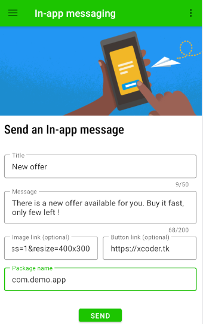

# In-app messaging
Clorabase In-App Messaging helps you engage your app's active users by sending them targeted, contextual messages that encourage them to use key app features. For example, you could send an in-app message to get users to subscribe, watch a video, complete a level, or buy an item.

### Key features
- Unlimited In-app messaging
- Simple & lightweight SDK
- Remote code execution (comming soon)


## Initializing
To use this feature you have to initialize it first. It is recommanded to initialize it in **Application's onCreate()**, like this:
```java
public class MainActivity extends Application {
    @Override
    public void onCreate() {
        super.onCreate();
        ClorabaseInAppMessaging.init(this,projectId,channel);
    }
}
```


## Sending In-app message
To send a In-app message, In the console goto **In-app messaging** option and fill the blanks of the message. Click **send** button to send the notification.



Here, **Channel** is the name of the messaging channel on which you want to send In-app message. That app must have been initialized through the sdk method.

*That's all what you need to know about in-app messaging*
