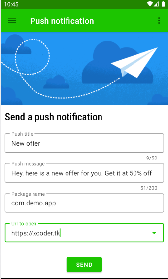

# Push notification
Clorabase push notification is a messaging solution for android platform that lets you reliably send messages at no cost.
Using CPM (Clorabase push messaging), you can notify a client app that new email or other data is available to sync. You can send notification messages to drive user re-engagement and retention. For use cases such as instant messaging, a message can transfer a payload of up to 4000 bytes to a client app.

### Key features
- Unlimited push notifications
- Simple & lightweight SDK
- Transfer of data payload (comming soon)


## Initializing
Just initialize the class and rest it will manage itself. It is recommanded to initialize it in **Application's onCreate()**, like this:
```java
public class MainActivity extends Application {
    @Override
    public void onCreate() {
        super.onCreate();
        ClorabasePushMessaging.init(this, data -> {
            // Called when notification is clicked          
            // data will be always null until it is implemented in console          
        });
    }
}
```


## Sending push notifiction
To send a push notification, In the console, goto **Push messaging** option and fill the blanks of the notifications. Click **send** button to send the notification.



Here, **Package name** is the package name of the app to whome you want to send push notification. That app must have been initialized through the sdk method.

*That's all what you need to know about push notification*
