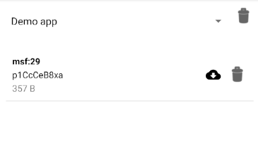

# Clorabase storage
Storage for Clorabase is built for app developers who need to store and serve user-generated content, such as photos or videos or any other files. It is like a cloud bucket where you can upload files which are required by the app. You can use SKD to upload,download and delete the file.

## Key features
- Max file size is 5GB
- Simple & easy SDK
- Unlimied storage & uploades

### Initializing the class.
To use any method of the class, first you have to initialize it. Use `getInstance(Context)` method to initialize & get the refference of the class.

```java
ClorabaseStorage storage = ClorabaseStorage.getInstance(this);
```

### Uploading file to storage
To upload file to the storage, use `upload(Inputstream,String,ClorabaseCallback)` method.
First, get inputstream of the file like below:
```java
InputStream inputStream = new FileInputStream(new File("/path/to/file")); // To create inputstream from a file.
InputStream inputStream = getContentResolver().openInputStream(uri); // To get inputstream from a file uri.
```
Then just pass this along with the filename & a progress listener. like this:
```java
storage.upload(inputStream,"filename", new ClorabaseStorage.ClorabaseCallback() {
    @Override
    public void onFailed(@NonNull Exception e) {
        // Check the exception
    }
    @Override
    public void onSuccess(String fileId) {
        // fileId is the id of the file that is uploaded
        // This id is required when downloading or deleting the file.
    }
    @Override
    public void onProgress(int percentage) {
        // percentage of the progress
    }
});
```
?> Note that Success/Failure are independent of progress. It means that upload may fail even if the progress method is called.

### Downloading file from storage
To download a file from clorabase storage, use `download(String,File,ClorabaseCallback)` method.
```java
storage.download("fileId", getExternalFilesDir(null), new ClorabaseStorage.ClorabaseCallback() {
    @Override
    public void onFailed(@NonNull Exception e) {
        // Download failed
    }
    @Override
    public void onSuccess(String fileId) {
        // fileId --> The same id you passes in the method.
        // Download completed.
    }
    @Override
    public void onProgress(int percentage) {
        // Percentage of the download
    }
});
```

### Deleting file
Deleting file is also as easy as deleting a file on local filesystem. Just call `delete(String,ClorabaseCallback)` providing a fileId and a callback.
```java
storage.delete("fileId", new ClorabaseStorage.ClorabaseCallback() {
    @Override
    public void onFailed(@NonNull Exception e) {
        // File not deleted, see the exception
    }
    @Override
    public void onSuccess(String fileId) {
        // File deleted !
    }
    @Override
    public void onProgress(int percentage) {
        // This method is never called during deleting a file.
    }
});
```


### Managing storage
You can also manage your storage from the console. Just goto 'Storage' option & add your app.


After that, you will see the number of files in your storage.



You can switch between apps. Each app has a seperate database & storage.


### [Example](https://github.com)
*That's all what you need to know about the clorabse storage*


