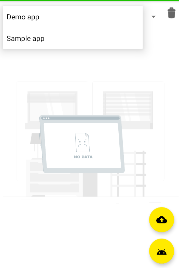

# Clorabase storage
Storage for Clorabase is built for app developers who need to store and serve user-generated content, such as photos or videos, or any other files. It is like a cloud bucket where you can upload files that are required by the app. You can use SDK to upload, download and delete the file.

## Key features
- Max file size is 5GB
- Simple & easy SDK
- Unlimited storage & uploads

### Initializing the class.
***First of all, configure your app for clorabase storage from the console***. Then,
initialize the class as follows:
```java
ClorabaseStorage.ClorabaseStorageCallback callback = new ClorabaseStorage.ClorabaseStorageCallback() {
    @Override
    public void onFailed(@NonNull Exception e) {
        // storage operation failed
    }
    
    @Override
    public void onProgress(int prcnt) {
        System.out.println("Progress: " + prcnt);
    }
    
    @Override
    public void onComplete(@NonNull String fileId) {
        // save the fileId
    }
};
ClorabaseDatabase storage = new ClorabaseStorage(STORAGE_ID, "TOKEN",callback);
```
This callback will be triggered on the upload or download event of the clorabase.

### Uploading file to storage
To upload a file to the storage, use the `upload(File)` method.

?> Tip: First move the file to your app external files directory and then pass the file from there to get read permission.

```java
storage.upload(new File("path/to/file"));
```
Now save the fileId which is in the `onComplete()` method. This will be required to download the same file.
### Downloading file from storage
To download a file from clorabase storage, use `download(String,File)` method.
```java
storage.download(FILE_ID,new File("path/to/directory"));
```


### Managing storage
You can manage your storage from the console. Just go to the 'Storage' option & add your app.


After that, you will see the number of files in your storage.


You can switch between apps. Each app has a separate database & storage.




### [Example](https://github.com)
*That's all you need to know about the clorabse storage*


