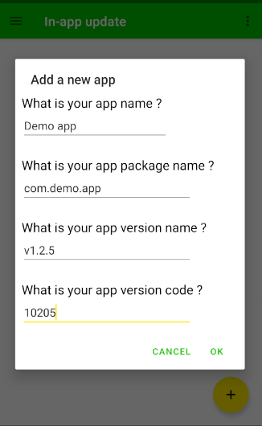
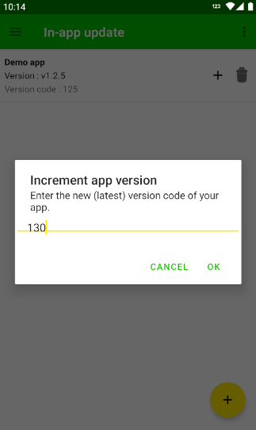

# In-App updates
It is common to find & fix bugs after releasing app to production. However, you need to somehow notify the user about the new update that contain bugs fixes or the new features. Through this new feature, You can push update anytime & can notify users about the new update. It is best for the apps which are not on play-store otherwise, you must consider using [Playcore library](https://developer.android.com/guide/playcore/in-app-updates)

## Key features
- In-app download (comming soon)
- Simple & easy SDK
- Various update modes

### Initializing the class
You just have to initialize the class and rest the library will take care. Its recommanded to initialize this in **Application's** or else in **LAUNCHER** activity `onCreate()`.

Use the static `init(Context,Link)` method of class `ClorabaseInAppUpdate` passing context and a link from where user can update your app.
```java
ClorabaseInAppUpdate.init(this,"https://xcoder.tk/apps");
```
?> Tip : Use direct download link of your app so that it can be downloaded as user press **Update** button

### Adding app in clorabase
For this to work, you have to first add the app in clorabase in-app updates list. You can do this easily through the console by clicking the floating button. See the picture below:



### Incrementing app version
When you have published your new update, increment its version from the console. To increment version, click '+' icon & enter new version code. This code should be greater then the older one.




### [Example](https://github.com)
*That's all what you need to know about the in-app update*


